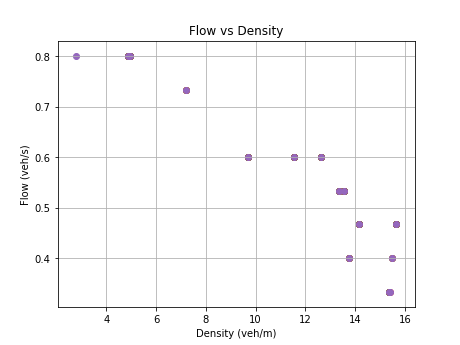
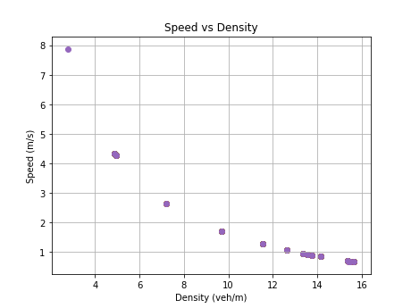

# ITSC 2024 Reproducibility in Transportation Research: A Hands-on Tutorial

This repository is the official implementation of [My Paper Title](https://arxiv.org/abs/2030.12345). 

>📋  Optional: include a graphic explaining your approach/main result, bibtex entry, link to demos, blog posts and tutorials

## Requirements

To install requirements:

```setup
pip install -r requirements.txt
```

>📋  Describe how to set up the environment, e.g. pip/conda/docker commands, download datasets, etc...

Here are the results of my simulation:
 